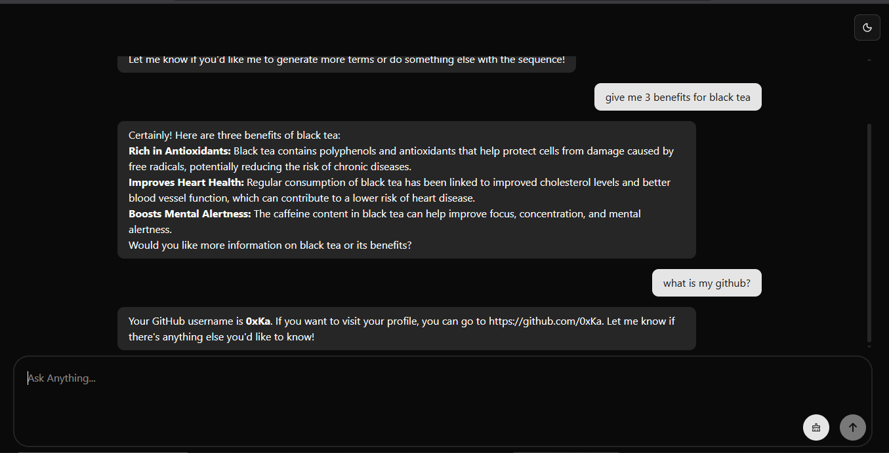

# AI Chatbot

A full‑stack AI chatbot built with React and Express. The project uses Bun for running both client and server, using a monorepo structure with Bun workspaces



## Features

- React client with a clean chat UI, Markdown rendering, and dark/light theme toggle
- Express server endpoint for chat requests
- Conversation continuity via in‑memory response tracking
- TypeScript across client and server
- Tailwind CSS v4 with design tokens and animations
- Local dev runner that starts both client and server concurrently

## Tech Stack

- Client: React, Vite, Shadcn, Tailwind CSS, Axios, React Hook Form, React Markdown
- Server: Express, Zod, OpenAI SDK
- Runtime/Tooling: Bun, TypeScript, Concurrently
- Monorepo: Bun workspaces

## Server Chat API

- POST /api/chat
  - Body: `{ prompt: string, conversationId: guid }`
  - Validated with Zod in [`chatController.sendMessage`](packages/server/controllers/chat.controller.ts)
  - Calls OpenAI Responses API in [`chatService.sendMessage`](packages/server/services/chat.services.ts)
  - Returns: `{ reply: string }`

## Prerequisites

- Bun v1.3+
- Node.js 18+ (for tooling)
- OpenAI API key

## Setup

1. Install dependencies:

   ```bash
   bun install
   ```

2. Configure environment:

   - Copy `.env.example` to `.env` in [packages/server](packages/server)
   - Set `OPENAI_API_KEY` and optionally `PORT`

3. Run both client and server from the root:
   ```bash
   bun run index.ts
   ```
   - Server: http://localhost:3000
   - Client (Vite): http://localhost:5173 (proxied to `/api`)
